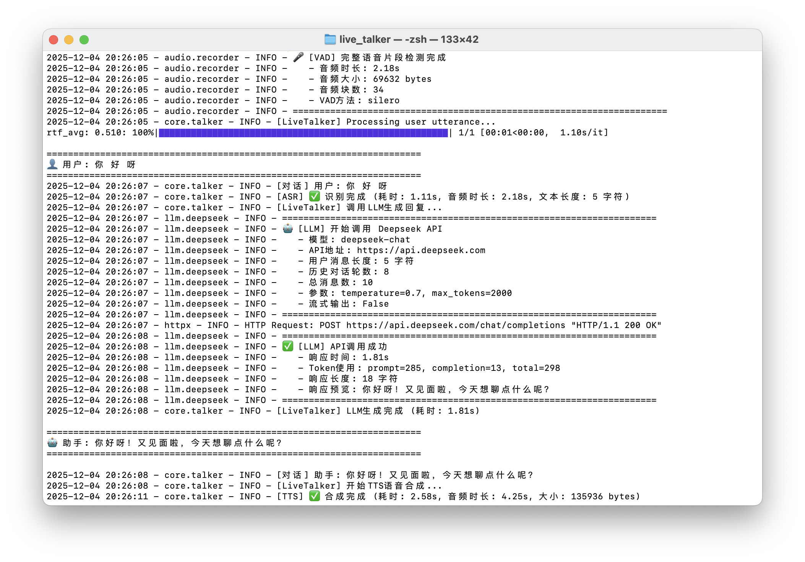

# Live Talker - Real-time Voice Conversation System

## Overview

Live Talker is a complete real-time voice conversation system, designed based on the `perception/audio` module from the Eva project, implementing a full pipeline from voice input to intelligent responses.

[中文文档](docs/README_zh.md)


## Demo

You can view the following demo to see Live Talker's complete workflow and UI:

<video src="docs/demo.MOV" controls width="800"></video>

## Debug Log Reference

When encountering issues, you can check the debug logs output in the terminal to understand the status of each system module:




## Core Features

- 🎤 **Real-time Speech Recognition (ASR)** - Supports SenseVoice (default), FunASR, Whisper, FireRedASR
  - **SenseVoice**: Alibaba's latest model with emotion recognition and 50+ language support
- 🔊 **Text-to-Speech (TTS)** - Supports Edge-TTS, Pyttsx3
- 🎯 **Voice Activity Detection (VAD)** - Automatic segmentation, interruption detection
- 🤖 **Intelligent Conversation (LLM)** - Deepseek API integration
- ⚡ **Low Latency** - Optimized real-time processing pipeline

## Known Issues

- VAD

## Roadmap

- [ ] Support for more LLM providers (OpenAI, Anthropic, etc.)
- [ ] Web-based GUI client
- [x] SenseVoice ASR with emotion recognition (Phase 1 ✓)
- [ ] MeloTTS for open-source TTS (Phase 2)
- [ ] TEN-VAD for better VAD (Phase 3)
- [ ] Ollama local LLM support (Phase 4)
- [ ] Streaming pipeline for <1s latency (Phase 5)
- [ ] Multi-language support
- [ ] Conversation history persistence
- [ ] Custom wake word detection
- [ ] Audio effects and filters
- [ ] Plugin system for extensibility


## Quick Start

### Install Dependencies

```bash
# Create conda environment
conda create -n live_talker python=3.10
conda activate live_talker

# Install system dependencies (required)
# macOS:
brew install ffmpeg

# Ubuntu/Debian:
sudo apt-get install ffmpeg

# Windows: Download from https://ffmpeg.org/download.html and add to PATH
# Or use conda:
conda install -c conda-forge ffmpeg

# Install Python dependencies
pip install -r requirements.txt
```

**Note**: Edge-TTS requires FFmpeg to convert MP3 to PCM format. If FFmpeg is not installed, you will encounter a `ffprobe` not found error.

### Configure Environment Variables

Create a `.env` file in the project root directory (or copy `.env.example`):

```bash
# Required: Set Deepseek API Key
DEEPSEEK_API_KEY=your-deepseek-api-key-here

# Optional: Custom model cache directory
MODEL_CACHE_DIR=D:\models
```

For more configuration options, please refer to the `.env.example` file.

### Run Examples

```bash
# Basic demo
python examples/basic_demo.py

# Full feature demo
python examples/full_demo.py

# Command-line main program
python main.py

# Qt GUI client
cd client/qt
pip install -r requirements.txt
python main.py
```

## Project Structure

```
live_talker/
├── audio/          # Audio processing module
├── asr/            # ASR speech recognition module
├── tts/            # TTS speech synthesis module
├── llm/            # LLM conversation module
├── core/           # Core conversation engine
├── client/         # Clients
│   └── qt/         # Qt GUI client
└── examples/       # Example code
```

## Configuration

Edit `config.py` or set environment variables:

```bash
# Deepseek API Key
export DEEPSEEK_API_KEY="your-api-key"

# ASR engine selection
export ASR_ENGINE="sensevoice"  # sensevoice (default), funasr, whisper, fireredasr

# TTS engine selection
export TTS_ENGINE="edge"    # edge, pyttsx3

# Model cache directory (default: D:\models)
export MODEL_CACHE_DIR="D:\\models"
```

### Model Download Paths

All model files will be downloaded to the specified cache directory:
- **ModelScope (FunASR)**: `D:\models\modelscope`
- **HuggingFace (Whisper)**: `D:\models\huggingface`
- **Torch Hub (Silero VAD)**: `D:\models\torch`

You can customize the path using the `MODEL_CACHE_DIR` environment variable.

## Usage Example

```python
from core.talker import LiveTalker
from config import TalkerConfig

# Initialize with default config (SenseVoice ASR)
talker = LiveTalker()

# Or customize configuration
config = TalkerConfig()
config.asr.engine = "sensevoice"  # Use SenseVoice (default)
config.asr.sensevoice_language = "auto"  # auto, zh, en, yue, ja, ko

talker = LiveTalker(config)

# Start conversation
talker.start()

# Automatic processing:
# User speaks → ASR recognition → LLM generates response → TTS synthesis → Playback
```

## Tech Stack

- **ASR**: SenseVoice (default), FunASR, Whisper, FireRedASR
- **TTS**: Edge-TTS, Pyttsx3
- **VAD**: Silero, WebRTC, Energy-based
- **LLM**: Deepseek API
- **Audio**: PyAudio, NumPy

## References

- Eva project: `perception/audio` module
- Voice Benchmark: ASR/TTS comparison project

## License

MIT License
